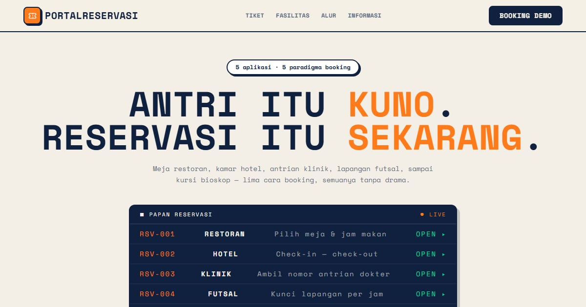

# PortalReservasi — Lima Cara Mengambil Antrian

PortalReservasi: 5 aplikasi booking dengan paradigma berbeda — restoran, hotel, klinik, futsal, dan bioskop.

**Demo live:** https://portal-reservasi-nu.vercel.app



> Katalog demo milik PintuWeb. Setiap kartu menautkan ke demo live yang bisa dicoba.

## Konsep

Katalog aplikasi reservasi. Gaya boarding pass: papan keberangkatan di hero dan kartu tiket berperforasi.

## Varian yang dipamerkan (5)

- [Sinema Nusantara](https://reservasi-bioskop.vercel.app)
- [Arena Futsal Garuda](https://reservasi-futsal.vercel.app)
- [Senja Bay Resort](https://reservasi-hotel-kappa.vercel.app)
- [Klinik Sehat Sentosa](https://reservasi-klinik-rose.vercel.app)
- [Saung Rasa](https://reservasi-restoran-gilt.vercel.app)

## Halaman

`/`

## Teknologi

- Next.js 15.5 (App Router) dan React 19
- Tailwind CSS v4
- JavaScript
- Framer Motion, Lucide (ikon)
- Font: Barlow Condensed, Space Mono (next/font)
- SEO: metadata per halaman, Open Graph, JSON-LD, sitemap.xml, dan robots.txt

## Menjalankan secara lokal

```bash
npm install
npm run dev
```

Buka http://localhost:3000. Untuk build produksi: `npm run build` lalu `npm start`.

---

Dibuat oleh [PintuWeb](https://pintuweb.com), jasa pembuatan website.
